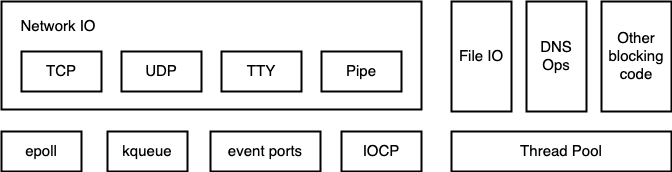
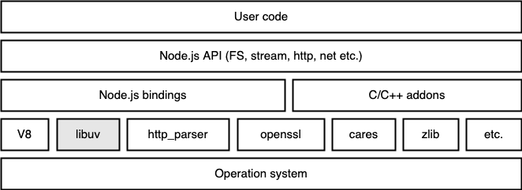
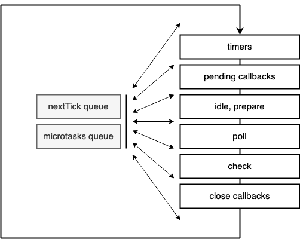

# альтернативный event loop на libuv - uvloop

<a name="index"></a>
* [5 способов параллелить задачи](#parallel)
* [структура асинхронного приложения](#app_pseudocode)
* [архитектура node.js](#nodejs_architecture)
* [фазы событийного цикла node.js](#node_event_loop_phases)
* [событийный цикл asyncio](#asyncio_event_loop)
* [альтернативные реализации цикла событий для asyncio](#asyncio_loop_alternatives)
* [подключение uvloop и его результаты](#uvloop_results)

<a name="parallel"></a>
## 5 способов параллелить задачи [^](#index "к оглавлению")
1. на каждую создаем новый поток (в питоне только io-bound, в других языках и cpu-bound)
2. на каждую создаем новый процесс (io- и cpu-bound задачи)
3. выполняем задачу на заранее созданном потоке из пула (аналогично 1, меньше расходы)
4. выполняем задачу на заранее созданном процессе из пула (аналогично 2, меньше расходы)
5. выполняем задачи асинхронно (только io-bound задачи и только в неблокирующем режиме)

[Подробнее про плюсы и минусы каждого метода](../01-concurrency/README.md)

### Асинхронщина на уровне ОС
Реализуется за счет возможностей ОС наблюдать за группой дескрипторов и выбирать из них готовые
- linux: [poll](https://man7.org/linux/man-pages/man2/poll.2.html), [select](https://man7.org/linux/man-pages/man2/select.2.html), [epoll](https://man7.org/linux/man-pages/man7/epoll.7.html) (reactor), [aio](https://man7.org/linux/man-pages/man7/aio.7.html), [io_uring](https://man.archlinux.org/man/io_uring.7.en)
- mac, *bsd: [kqueue](https://www.freebsd.org/cgi/man.cgi?kqueue)
- solaris: event ports
- windows: [IOCP](https://docs.microsoft.com/en-us/windows/win32/fileio/i-o-completion-ports) (proactor)

### Поддержка в языках
Та или иная реализация есть почти во всех языках, например:
Python (Asyncio, Twisted, Gevent и Tornado), Javascript (nodejs, deno),
netty ([EpollEventLoop.java](https://github.com/netty/netty/blob/6a84af796571c7b54f0bb314db7f3bd8dd194311/transport-classes-epoll/src/main/java/io/netty/channel/epoll/EpollEventLoop.java#L307-L413)),
[tokio (rust)](https://github.com/tokio-rs/tokio), [evio (go)](https://github.com/tidwall/evio), [amp (php)](https://github.com/amphp/amp),
[eventmachine (ruby)](https://github.com/eventmachine/eventmachine), [coro-async(C++)](https://github.com/arun11299/coro-async),
а также применяется в браузерах, nginx, qt, gtk.

### Системные вызовы в linux (epoll)
* [epoll_create](https://man7.org/linux/man-pages/man2/epoll_create.2.html) - создает экземпляр epoll и возвращает указывающий на него файловый дескриптор
* [epoll_ctl](https://man7.org/linux/man-pages/man2/epoll_ctl.2.html) - добавляет, изменяет, удаляет дескрипторы из списка интереса экземпляра epoll. В объекте event содержится тип нужного события и пользовательские данные
* [epoll_wait](https://man7.org/linux/man-pages/man2/epoll_wait.2.html) - ожидает события на экземпляре epoll, возвращает произошедшие отслеживаемые события

Пример кода на C:

```c
int ep = epoll_create(1);
struct epoll_event new_ev;
new_ev.data.fd = server;
new_ev.events = EPOLLIN;
epoll_ctl(ep, EPOLL_CTL_ADD, server, &new_ev);
while(1) {
    if (epoll_wait(ep, &new_ev, 1, 2000) == 0) {
        printf("Timeout\n");
            continue;
    }
    if (new_ev.data.fd == server) {
        int client_sock = accept(server, NULL, NULL);
        printf("New client\n");
        new_ev.data.fd = client_sock;
        new_ev.events = EPOLLIN;
        epoll_ctl(ep, EPOLL_CTL_ADD, client_sock, &new_ev);
    } else {
        printf("Interact with fd %d\n", (int)new_ev.data.fd);
        if (interact(new_ev.data.fd) == 0) {
            printf("Client disconnected\n");
            close(new_ev.data.fd);
            epoll_ctl(ep, EPOLL_CTL_DEL, new_ev.data.fd, NULL);
        } 
    }
} 
close(ep);
```

<a name="pseudocode"></a>
## Структура подобных приложений [^](#index "к оглавлению")
Включают компоненты:
- бесконечный цикл
- очереди задач (одна или несколько)
- опрос готовых
- пул потоков для блокирующих (io-, cpu-bound задач) операций
- также возможна работа с таймерами

```
ready = []
while True:
    poll_for_io()
    
    for callback in ready:
        callback()
```

<a name="nodejs_architecture"></a>
## Архитектура node.js  [^](#index "к оглавлению")

<br />
*Node.js ничем не отличается от других асинхронных систем*

Node.js (код https://github.com/nodejs/node) использует ряд C/C++ библиотек 
(https://github.com/nodejs/node/tree/master/deps) и биндинги к ним, а также аддоны на C++.

<br />
*Архитектура node.js*

Node.js использует движок [V8](https://github.com/v8/v8) для выполнения javascript, однако он не содержит 
своей реализации event loop'а, для чего используется событийный цикл из библиотеки
libuv. 

В отличие от node.js, барузер Chrome, также основанный на V8, использует реализацию событийного цикла из другой 
библиотеки - [libevent](https://libevent.org/) ([github](https://github.com/libevent/libevent)), а аналог node.js - deno, 
разработанный также Райаном Далем - из библиотеки [tokio](https://github.com/tokio-rs/tokio) (rust).

<a name="node_event_loop_phases"></a>
## Node.js event loop

<br />

Фазы event loop:
* timers - коллбеки из setTimeout и setInterval
* pending callbacks - коллбеки сетевых операций
* idle, prepare - нет доступа к ним, перед чтением файла
* poll - опрос IO, выполнение IO-коллбеков
* check - коллбеки из setImmediate
* close - коллбеки из .close()-методов

Между фазами event loop выполняет коллбеки из приоритетных очередей:
* nextTick - коллбеки из process.nextTick()
* microtaskQueue - коллбеки из промисов,  queueMicrotask

В коде библиотеки libuv есть только основная очередь задач и еще одна для setImmediate, приоритетных очередей она не
содержит. Микротаски реализованы в V8, а очередь `nextTick` - в коде самой ноды.

[Пример 1 (js)](node_js_loop.js) - что будет выведено в консоль?

```console
node node_js_loop.js
strace -e epoll_create1,epoll_wait,epoll_ctl node node_js_loop.js >> /dev/null
```

## libuv
Библиотека [libuv](https://libuv.org) ([github](https://github.com/libuv/libuv)) была создана
для node.js ее автором в 2009 г. для кроссплатформенной работы, один интерфейс - несколько ОС.
Она хорошо написана и используется также во многих других популярных проектах.

[uv_run](https://github.com/libuv/libuv/blob/c9406ba0e3d67907c1973a71968b89a6bd83c63c/src/unix/core.c#L365),
[uv__io_poll](https://github.com/libuv/libuv/blob/caf22ddbf5b1b8d06006b24f3b50c5e698fe2d8c/src/unix/epoll.c#L103)

В libuv нет очередей nextTick и микротасок, так как первая реализована в самой ноде, а вторая - в V8.

<a name="asyncio_event_loop"></a>
## Стандартный событийный цикл asyncio [^](#index "к оглавлению")

Написан на питоне. Используется по умолчанию.

* [Документация](https://docs.python.org/3/library/asyncio-eventloop.html)
* Код [events.py](https://github.com/python/cpython/blob/3.9/Lib/asyncio/events.py) `->`
  [base_events.py](https://github.com/python/cpython/blob/3.9/Lib/asyncio/base_events.py#L1815-L1891) `->`
  [selector_events.py](https://github.com/python/cpython/blob/3.9/Lib/asyncio/selector_events.py)

Аналоги функций node.js:
* `setImmediate(cb)` -> `loop.call_soon(cb)`
* `setTimeout(cb, timeout)` -> `loop.call_later(timeout, cb)`

Содержит 
* очереди: 1) таймеры (с приоритетом); 2) готовые коллбеки
* фазы: 1) опрос IO; 2) выполнение результирующих коллбеков; 3) планирование call_later; 4) выполнение готовых коллбеков

Сильно сокращенный и упрощенный код в интерпретаторе:

```python
import concurrent.futures
import heapq

class EventLoop:
    def __init__(self):
        self._ready = collections.deque()
        self._scheduled = []
        self.stopping = False
        
    def run_forever(self):
        while True:
            self._run_once()
            
            if self._stopping:
                break
    
    def _run_once(self):
        """Run one full iteration of the event loop.
        This calls all currently ready callbacks, polls for I/O,
        schedules the resulting callbacks, and finally schedules
        'call_later' callbacks.
        """

        heapq.heapify(_scheduled)   # преобразовывает список в кучу

        # 1 ----------- Polls for IO -----------
        event_list = self._selector.select(timeout)  # epoll_wait

        # 2 ----------- Schedules the resulting callbacks ---------
        for key, mask in event_list:
            fileobj, (reader, writer) = key.fileobj, key.data
            if mask & selectors.EVENT_READ:
                self._ready.append(reader)
            if mask & selectors.EVENT_WRITE:
                self._ready.append(writer)

        # 3 ------------- Schedules 'call_later' callbacks --------------
        end_time = self.time() + self._clock_resolution
        while self._scheduled:
            handle = self._scheduled[0]
            if handle._when >= end_time:
                break
            handle = heapq.heappop(self._scheduled)
            handle._scheduled = False
            self._ready.append(handle)

        # 4 ----------- Calls all currently ready callbacks -------------
        ntodo = len(self._ready)
        for i in range(ntodo):
            handle = self._ready.popleft()
            handle._run()
    
    def stop(self):
        self._stopping = True
        
    def create_task(self, coro, *, name=None):
        return tasks.Task(coro, loop=self, name=name)
        
    def call_soon(self, callback, *args, context=None):
        handle = events.Handle(callback, args, self, context)
        self._ready.append(handle)

    def call_later(self, delay, callback, *args, context=None):        
        timer = events.TimerHandle(self.time() + delay, callback, args, self, context)
        heapq.heappush(self._scheduled, timer)
        timer._scheduled = True
        return timer
        
    def run_in_executor(self, executor, func, *args):
        if executor is None:
            executor = self._default_executor
            if executor is None:
                executor = concurrent.futures.ThreadPoolExecutor(
                    thread_name_prefix='asyncio'
                )
                self._default_executor = executor
        return futures.wrap_future(
            executor.submit(func, *args), loop=self)


class Task(Future):  

    """A coroutine wrapped in a Future."""

    def __init__(self, coro, *, loop=None, name=None):
        super().__init__(loop=loop)

        self._coro = coro
        self._context = contextvars.copy_context()

        self._loop.call_soon(self.__step, context=self._context)
        
    def __step(self, exc=None):
        coro = self._coro

        try:
            if exc is None:
                result = coro.send(None)
            else:
                result = coro.throw(exc)
        except StopIteration as exc:
                super().set_result(exc.value)


class Future:
    _state = _PENDING
    _result = None
    _exception = None
    _loop = None

    def __init__(self, *, loop=None):
        self._loop = loop
        self._callbacks = []

    def cancel(self, msg=None):
        """Cancel the future and schedule callbacks.
        If the future is already done or cancelled, return False.  Otherwise,
        change the future's state to cancelled, schedule the callbacks and
        return True.
        """
        if self._state != _PENDING:
            return False
        self._state = _CANCELLED
        
        callbacks = self._callbacks[:]
        if not callbacks:
            return

        self._callbacks[:] = []
        for callback, ctx in callbacks:
            self._loop.call_soon(callback, self, context=ctx)
        return True

    def add_done_callback(self, fn, *, context=None):
        if self._state != _PENDING:
            self._loop.call_soon(fn, self, context=context)
        else:
            if context is None:
                context = contextvars.copy_context()
            self._callbacks.append((fn, context))

    def set_result(self, result):
        if self._state != _PENDING:
            raise exceptions.InvalidStateError(f'{self._state}: {self!r}')
        self._result = result
        self._state = _FINISHED
        
        callbacks = self._callbacks[:]
        if not callbacks:
            return

        self._callbacks[:] = []
        for callback, ctx in callbacks:
            self._loop.call_soon(callback, self, context=ctx)
        return True

    def set_exception(self, exception):
        self._exception = exception
        self._state = _FINISHED
        
        callbacks = self._callbacks[:]
        if not callbacks:
            return

        self._callbacks[:] = []
        for callback, ctx in callbacks:
            self._loop.call_soon(callback, self, context=ctx)
        return True

    def __await__(self):
        if not self.done():
            self._asyncio_future_blocking = True
            yield self
        if not self.done():
            raise RuntimeError("await wasn't used with future")
        return self.result()  
```

[Пример 2 (python)](python_asyncio_loop.py) - что будет выведено в консоль?

```console
python3 python_asyncio_loop.js
strace -e epoll_create1,epoll_wait,epoll_ctl python3 python_asyncio_loop.js >> /dev/null
```

### Коллбеки vs корутины
В отличие от node.js, где в коде допустимы и коллбеки, и асинхронные функции, а первые до
недавнего времени еще и были лучше по производительности, а питоне в пользовательском коде должны
быть только корутины и таски, а коллбеки, фьючи - в низкоуровневом коде библиотек.
Но как же работают корутины, когда архитектура системы предусмаотривает работу с коллбеками?
В двух словах, корутина - это генератор, имеющий несколько шагов, и в коллбеке на какое-то событие
корутина прокручивается на один шаг вызовом `coro.send()`.

[Подробнее](02-asyncio/README.md)

<a name="asyncio_loop_alternatives"></a>
## Альтернативные реализации цикла событий для asyncio [^](#index "к оглавлению")

Написаны на C (либо Rust) для увеличения производительности системы.
Для использования с библиотекой asyncio event loop должен реализовывать
[методы класса `AbstractEventLoop`](https://github.com/python/cpython/blob/8b795ab5541d8a4e69be4137dfdc207714270b77/Lib/asyncio/events.py#L204) 
(run_forever, run_until_complete, stop, is_running, is_closed, close, shutdown_asyncgens, 
shutdown_default_executor, call_soon, call_later, call_at, time, create_future, create_task,
call_soon_threadsafe, run_in_executor, set_default_executor, getaddrinfo, getnameinfo,
create_connection, create_server, sendfile, start_tls, create_unix_connection, 
create_unix_server, create_datagram_endpoint, connect_read_pipe, connect_write_pipe, 
subprocess_shell, subprocess_exec, add_reader, remove_reader, add_writer, remove_writer, 
sock_recv, sock_recv_into, sock_sendall, sock_connect, sock_accept, sock_sendfile, 
add_signal_handler, remove_signal_handler, set_task_factory, get_task_factory, 
get_exception_handler, set_exception_handler, default_exception_handler, 
call_exception_handler, get_debug, set_debug).

### uvloop [^](#index "к оглавлению")
Написан Юрием Селивановым (core-разработчик питона) с использованием libuv в 2016 г. В настоящее время используется по умолчанию во всех современных
асинхронных фреймворках, кроме aiohttp, куда он легко подключается отдельно при желании. По сравнению со стандартным дает прирост производительности в 2-4 раза
(по данным [статьи](http://magic.io/blog/uvloop-make-python-networking-great-again/)), на реальных проектах результат скромнее,
но тоже ощутим (согласно замерам, проведенным в компании Rambler, ~30%).

* Биндинги: https://github.com/MagicStack/uvloop ([loop](https://github.com/MagicStack/uvloop/blob/master/uvloop/loop.pyx))
* Сама сишная либа: https://libuv.org/, https://github.com/libuv/libuv,
  [loop](https://github.com/libuv/libuv/blob/c9406ba0e3d67907c1973a71968b89a6bd83c63c/src/unix/core.c#L365)

Как использовать:

```python
import asyncio
import uvloop

asyncio.set_event_loop_policy(uvloop.EventLoopPolicy())  # старый способ
uvloop.install()  # новый способ
```

### tokio [^](#index "к оглавлению")
Написан с использованием tokio.rs в 2017 г., с 2018 г. проект не поддерживается более.

Как использовать:

```python
import asyncio
import tokio

asyncio.set_event_loop_policy(tokio.EventLoopPolicy())
```

* Биндинги: https://github.com/PyO3/tokio ([loop](https://github.com/PyO3/tokio/blob/master/src/event_loop.rs))
* Сама библиотека на rust: https://tokio.rs/, https://github.com/tokio-rs/tokio

<a name="uvloop_results"></a>
## Подключение uvloop и его результаты  [^](#index "к оглавлению")
В каждый воркер (процесс с собственым event loop'ом).

```python
uvloop.install()
```

Исследуемый сервис - относительно новый проект, торнадо 5 + нативные корутины.
Альтернативный event loop, написанный на C (либо Rust) нужен нам для снижения потребления CPU. 
Помог ли он?

По результатам нагрузочного тестирования отличия незначительные. После релиза на графиках
потребление CPU несколько снизилось, но ярко выраженного скачка, как это было при переходе 
с питона 3.5 на версию 3.7, не было.

Результат полностью соответствует ожиданиям, так как в tornado 5 все еще много костылей, и поэтому
event loop здесь не является узким местом.

Ожидается, что для tornado 6, а тем более современных фреймворков, результаты будут гораздо более 
ощутимые - и это подтверждается исследованиями, проведенными в ряде компаний.

Напротив, для более проблемного, с большим количеством блокирующих операций, старого проекта 
на tornado 5, да еще и на торнадовским корутинах, выигрыша вообще практически не будет.

## Дополнительные материалы:
* [Event loop в node.js](https://www.youtube.com/watch?v=7f787SsgknA)
* [Знай свой инструмент: Event Loop в libuv](https://habr.com/ru/post/336498/)
* [Browser event loop explainer](https://github.com/atotic/event-loop)
* [Further Adventures of the Event Loop - Erin Zimmer](https://www.youtube.com/watch?v=u1kqx6AenYw)
* [Документация libuv](http://docs.libuv.org/en/v1.x/design.html)
* [The Node.js Event Loop, Timers, and process.nextTick()](https://nodejs.org/en/docs/guides/event-loop-timers-and-nexttick/)
* [The method to epoll’s madness](https://copyconstruct.medium.com/the-method-to-epolls-madness-d9d2d6378642)
* [Node.js event loop architecture](https://medium.com/preezma/node-js-event-loop-architecture-go-deeper-node-core-c96b4cec7aa4)
* [Node.js Under The Hood #3 - Deep Dive Into the Event Loop](https://dev.to/khaosdoctor/node-js-under-the-hood-3-deep-dive-into-the-event-loop-135d)
* [Introduction to libuv: What's a Unicorn Velociraptor? - Colin Ihrig, Joyent](https://www.youtube.com/watch?v=_c51fcXRLGw)
